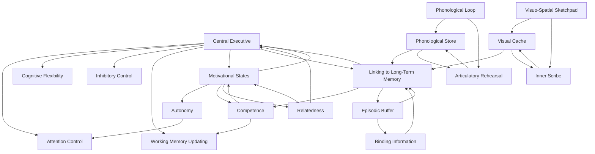
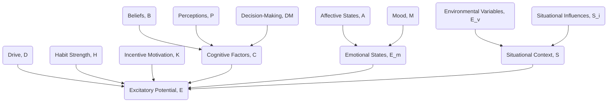
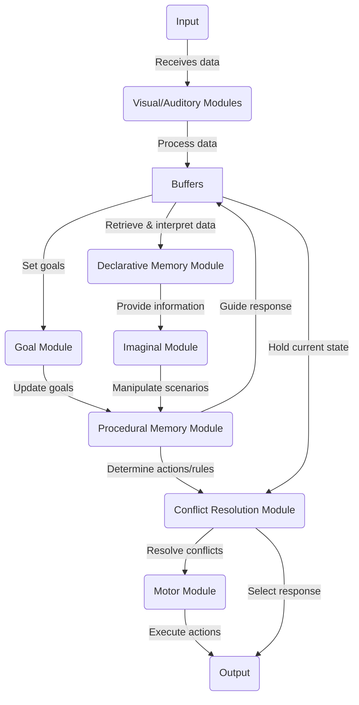

```mermaid
graph TB
    %% Emotion Regulation Components
    ER[Emotion Regulation]
    SS[Situation Selection]
    SM[Situation Modification]
    AD[Attentional Deployment]
    CC[Cognitive Change]
    RM[Response Modulation]

    %% Motivation Components
    IM[Intrinsic Motivation]
    EM[Extrinsic Motivation]
    SDi[Self-Determination - Intrinsic]
    SDe[Self-Determination - Extrinsic]
    HG[Hierarchical Goals]
    SCG[Self-Concordant Goals]
    PF[Promotion Focus]
    NF[Prevention Focus]
    BI[Behavioral Intentions]

    %% Cognitive Processes Components
    CE[Central Executive]
    PL[Phonological Loop]
    VS[Visuospatial Sketchpad]
    EB[Episodic Buffer]

    %% Perception and Appraisal Components
    CA[Cognitive Appraisal]
    AI[Affect as Information]
    SP[Self-Perception]
    CV[Achievement Emotions]

    %% Social and Behavioral Dynamics
    SPres[Self-Presentation]
    ED[Emotion Differentiation]
    SCa[Self-Control - Automatic]
    SCd[Self-Control - Deliberate]

    %% Relationships between components
    ER --> SS
    ER --> SM
    ER --> AD
    ER --> CC
    ER --> RM

    %% Motivation and Emotion Regulation
    IM --> ER
    EM --> ER
    IM --> BI
    EM --> BI
    SDi --> IM
    SDe --> EM
    HG --> IM
    HG --> EM
    SCG --> IM
    PF --> IM
    NF --> EM

    %% Cognitive Processes and Emotion Regulation
    CE --> ER
    PL --> CE
    VS --> CE
    EB --> CE

    %% Perception and Appraisal and Emotion Regulation
    CA --> ER
    AI --> ER
    SP --> ER
    CV --> ER

    %% Social and Behavioral Dynamics and Emotion Regulation
    SPres --> ER
    ED --> ER
    SCa --> ER
    SCd --> ER

    %% Feedback Mechanisms
    ER --> IM
    ER --> EM
    ER --> CE
    ER --> CA
    ER --> AI
    ER --> SP
    ER --> CV
    ER --> SPres
    ER --> ED
    ER --> SCa
    ER --> SCd

    %% Feedback from Cognitive Processes to Motivation
    CE --> IM
    CE --> EM
    CE --> BI

    %% Feedback from Motivation to Cognitive Processes
    IM --> CE
    EM --> CE
    BI --> CE

    %% Feedback from Perception and Appraisal to Motivation
    CA --> IM
    CA --> EM
    AI --> IM
    AI --> EM
    SP --> IM
    SP --> EM
    CV --> IM
    CV --> EM

    %% Feedback from Social and Behavioral Dynamics to Motivation
    SPres --> IM
    SPres --> EM
    ED --> IM
    ED --> EM
    SCa --> IM
    SCa --> EM
    SCd --> IM
    SCd --> EM
```

---
tags:
  - cognition
  - OC/half-baked
  - OC/collaboration
---
collaborative brainstorming - https://chatgpt.com/g/g-IibMsD7w8-obsidian-gpt-simple/c/9f098b1c-fdb5-4bcf-aefb-0cf9de928542

[[The Illusion Of Control - (very wide net)]]

main cognitive components via [[Working Memory]]

[[Central Executive]]
- [[Central Executive Network]]
[[Phonological Loop]]
   - [[Phonological Store]]
   - [[Articulatory Control Process]]
[[Visuospatial Sketchpad]]
[[Episodic Buffer]]

[[Self-Determination Theory]] 
- [[Causality Orientations Theory]]
	- [[Autonomy Orientation]]
	- [[Control Orientation]]
	- [[Impersonal Orientation]]
- [[Basic Psychological Needs Theory]]
	- [[Autonomy]]
	- [[Competence]]
	- [[Relatedness]]

Orientations impact how sensory and mental states are labeled

we'll also need to account for [[biopsychosocial drives]] which will generate the attractive/repulsive fields let's set aside the [[physiological drives]] for now and focus on the [[Psychological Drives]] and [[social drives]]. 
- 

Drives will also need to be influenced by needs and current needs orientations. 

---

