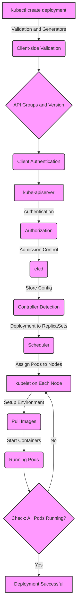

```mermaid
flowchart TD
    A[kubectl create deployment] -->|Validation and Generators| B(Client-side Validation)
    B --> C{API Groups and Version}
    C --> D(Client Authentication)
    D --> E[kube-apiserver]
    E -->|Authentication| F(Authorization)
    F -->|Admission Control| G(etcd)
    G -->|Store Config| H(Controller Detection)
    H -->|Deployment to ReplicaSets| I(Scheduler)
    I -->|Assign Pods to Nodes| J[kubelet on Each Node]
    J -->|Setup Environment| K(Pull Images)
    K -->|Start Containers| L(Running Pods)
    L --> M{Check: All Pods Running?}
    M -->|Yes| N[Deployment Successful]
    M -->|No| J

    classDef default fill:#f9f,stroke:#333,stroke-width:2px;
    class A,B,C,D,E,F,G,H,I,J,K,L,M,N default;
```

